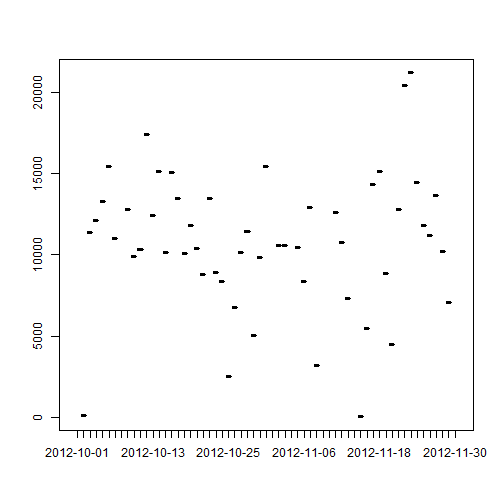
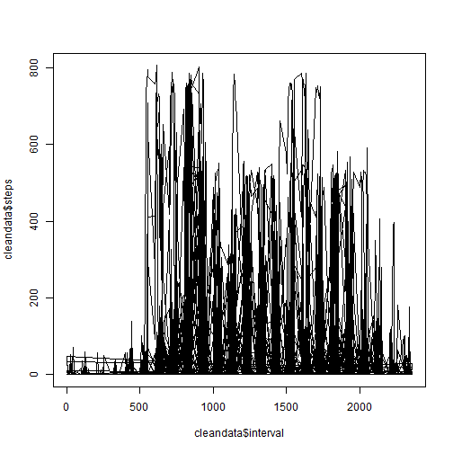
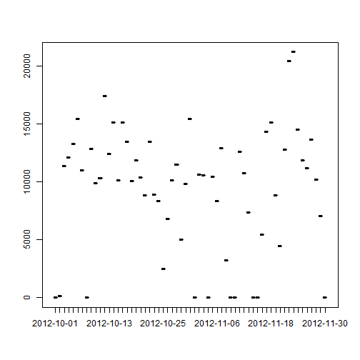

Reproducible Research - Peer Assessment 1
========================================================

## Loading and preprocessing the data

Load the data

```r
rawdata <- data.frame(read.csv("activity.csv"))
head(rawdata)
```

```
##   steps       date interval
## 1    NA 2012-10-01        0
## 2    NA 2012-10-01        5
## 3    NA 2012-10-01       10
## 4    NA 2012-10-01       15
## 5    NA 2012-10-01       20
## 6    NA 2012-10-01       25
```

Tidy data to exclude *NA*

```r
cleandata <- na.omit(rawdata)
head(cleandata)
```

```
##     steps       date interval
## 289     0 2012-10-02        0
## 290     0 2012-10-02        5
## 291     0 2012-10-02       10
## 292     0 2012-10-02       15
## 293     0 2012-10-02       20
## 294     0 2012-10-02       25
```


## What is mean total number of steps taken per day?

Grouping the total number of *steps* by *date* and plot the graphic.

```r
sumstep <- aggregate(cleandata$steps, list(date=cleandata$date), FUN=sum)
head(sumstep)
```

```
##         date     x
## 1 2012-10-02   126
## 2 2012-10-03 11352
## 3 2012-10-04 12116
## 4 2012-10-05 13294
## 5 2012-10-06 15420
## 6 2012-10-07 11015
```

```r
plot(sumstep$date, sumstep$x, type ="l")
```

 

Calculate and report the **mean** total number of steps taken per day

```r
mean1 <- aggregate(cleandata$steps, list(date=cleandata$date), mean)
head(mean1)
```

```
##         date       x
## 1 2012-10-02  0.4375
## 2 2012-10-03 39.4167
## 3 2012-10-04 42.0694
## 4 2012-10-05 46.1597
## 5 2012-10-06 53.5417
## 6 2012-10-07 38.2465
```

Calculate and report the **median** total number of steps taken per day

```r
median1 <- aggregate(cleandata$steps, list(date=cleandata$date), median)
head(median1)
```

```
##         date x
## 1 2012-10-02 0
## 2 2012-10-03 0
## 3 2012-10-04 0
## 4 2012-10-05 0
## 5 2012-10-06 0
## 6 2012-10-07 0
```


## What is the average daily activity pattern?

Make a plot

```r
plot(cleandata$interval, cleandata$steps, type="l")
```

 

Calculate the interval base on the max of step

```r
approx(x=cleandata$steps, y=cleandata$interval, xout=max(cleandata$steps))
```

```
## $x
## [1] 806
## 
## $y
## [1] 615
```


## Imputing missing values

### Calculate the number of **NA**

```r
s <- sum(is.na(rawdata))
```
The number of missing data is 2304

### Strategy for filling in missing values  
Because the number of zero step is big (11014/17568) and the histogram is right skew so we cannot use the mean to fill in the blank. Instead we will use the **median** for the **NAs**.

### Create a new dataset
We can see that the **median** are all **0** then we can replace them all with **0**

```r
rawdata$steps[is.na(rawdata$steps)] <- 0
tidydata <- rawdata
head(tidydata)
```

```
##   steps       date interval
## 1     0 2012-10-01        0
## 2     0 2012-10-01        5
## 3     0 2012-10-01       10
## 4     0 2012-10-01       15
## 5     0 2012-10-01       20
## 6     0 2012-10-01       25
```

### Make histogram, mean and median
Like doing in the 2nd part, but replace **cleandata** with **tidydata**  
Grouping the total number of *steps* by *date* and plot the graphic.

```r
sumstep <- aggregate(tidydata$steps, list(date=tidydata$date), FUN=sum)
head(sumstep)
```

```
##         date     x
## 1 2012-10-01     0
## 2 2012-10-02   126
## 3 2012-10-03 11352
## 4 2012-10-04 12116
## 5 2012-10-05 13294
## 6 2012-10-06 15420
```

```r
plot(sumstep$date, sumstep$x, type ="l")
```

 

Calculate and report the **mean** total number of steps taken per day

```r
mean2 <- aggregate(tidydata$steps, list(date=tidydata$date), mean)
head(mean2)
```

```
##         date       x
## 1 2012-10-01  0.0000
## 2 2012-10-02  0.4375
## 3 2012-10-03 39.4167
## 4 2012-10-04 42.0694
## 5 2012-10-05 46.1597
## 6 2012-10-06 53.5417
```

Calculate and report the **median** total number of steps taken per day

```r
median2 <- aggregate(tidydata$steps, list(date=tidydata$date), median)
head(median2)
```

```
##         date x
## 1 2012-10-01 0
## 2 2012-10-02 0
## 3 2012-10-03 0
## 4 2012-10-04 0
## 5 2012-10-05 0
## 6 2012-10-06 0
```

We can see that there is **NO** impact because the histogram is very right skew so when we added 0 to the dataset, mean and median is not changed.


## Are there differences in activity patterns between weekdays and weekends?

### Create a new factor variable in the dataset with two levels - "weekday" and "weekend" indicating whether a given date is a weekday or weekend day.

```r
library(openair)
```

```
## Warning: package 'openair' was built under R version 3.0.3
```

```r
tidydata$weektime <- as.factor(ifelse(weekdays(as.Date(tidydata$date)) %in% c("Saturday","Sunday"),"weekend", "weekday"))
head(tidydata)
```

```
##   steps       date interval weektime
## 1     0 2012-10-01        0  weekday
## 2     0 2012-10-01        5  weekday
## 3     0 2012-10-01       10  weekday
## 4     0 2012-10-01       15  weekday
## 5     0 2012-10-01       20  weekday
## 6     0 2012-10-01       25  weekday
```

